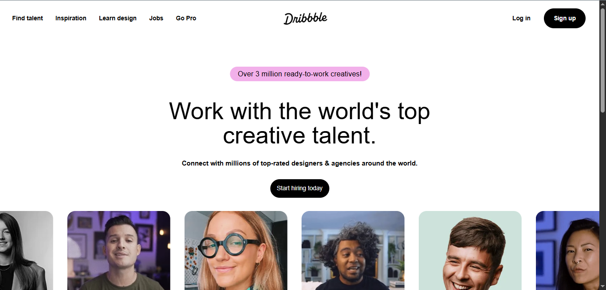
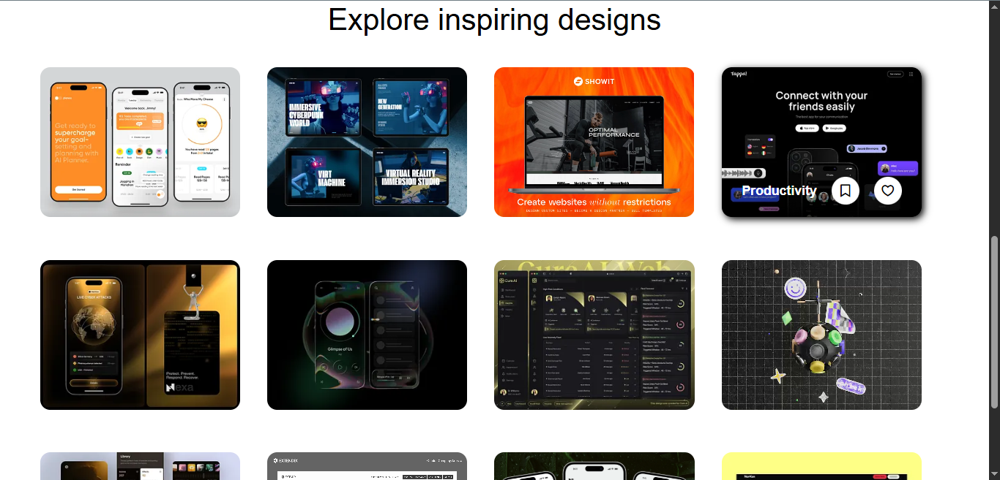

🎨 Dribbble Clone (HTML & CSS)
A Dribbble homepage UI clone built using HTML5 and CSS3.
This project is desktop-focused and was created to practice modern layouts, spacing, and visual design.

🚀 Live Preview
Run locally using Live Server:

## 📸 Screenshots

### Desktop Homepage

### Explore Designs Section

✨ Features
🎯 Dribbble-inspired UI design
🖥️ Desktop-first layout
🧩 CSS Grid & Flexbox usage
🎨 Clean typography & spacing
🔘 Styled navigation and buttons
⚡ Pure HTML & CSS (No JavaScript)
🛠️ Tech Stack
HTML5

CSS3

dribbble-clone/
│
├── index.html
├── style.css
│
├── assets/
│   └── screenshots/
│       ├── home.png
│       └── explore.png
│
├── .vscode/
│   └── settings.json
│
└── README.md
